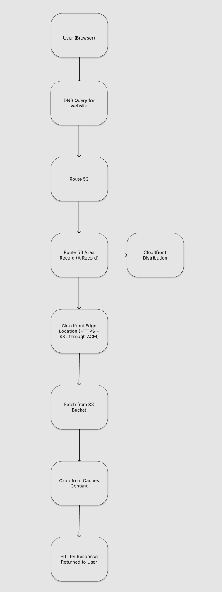
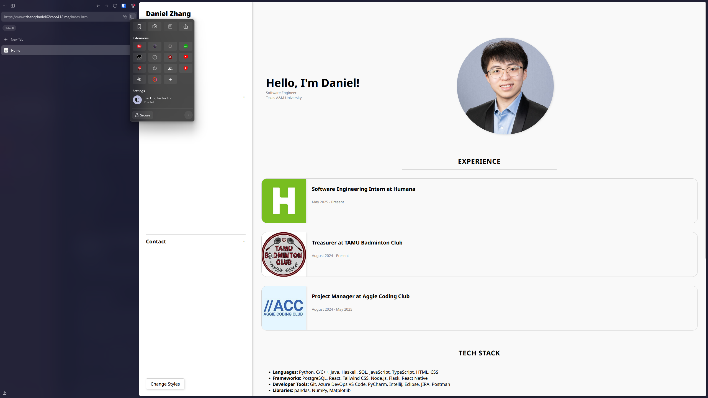
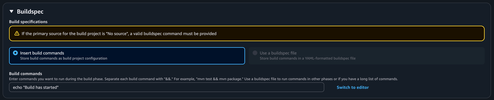
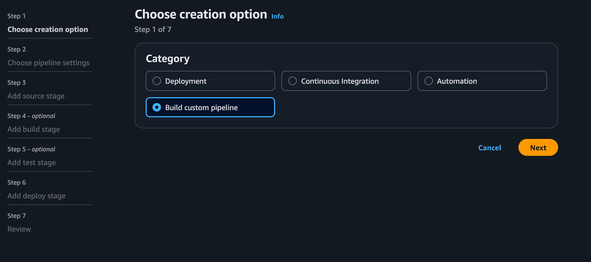
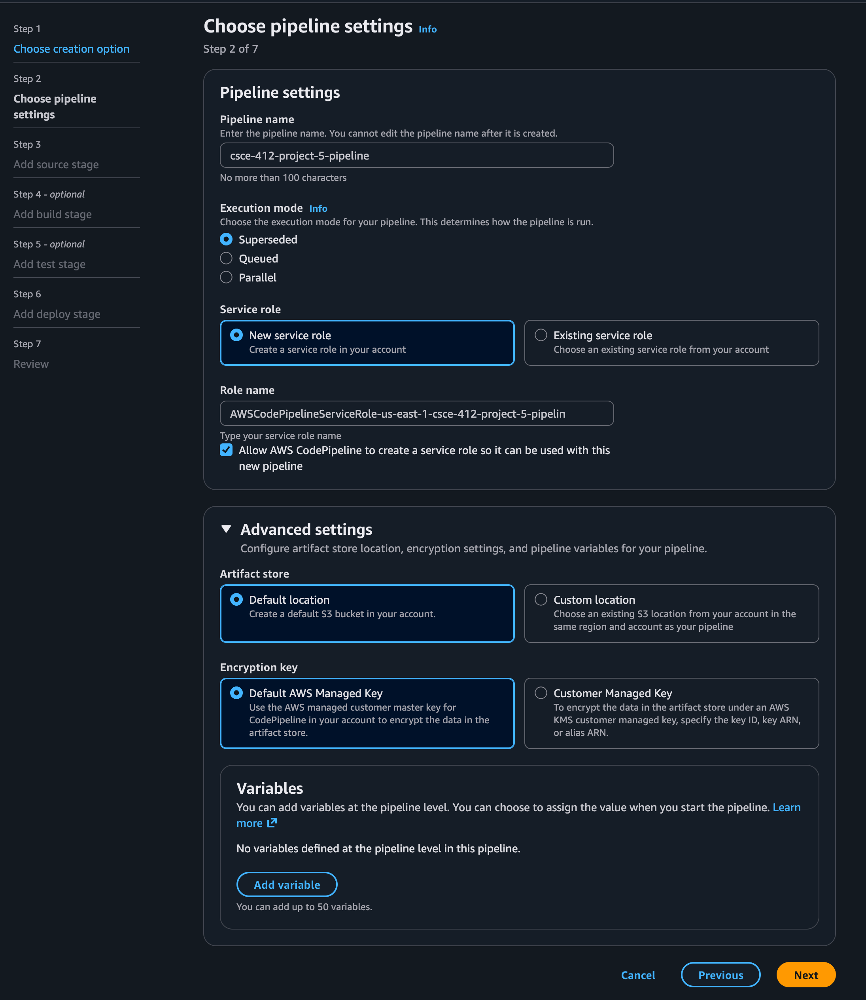
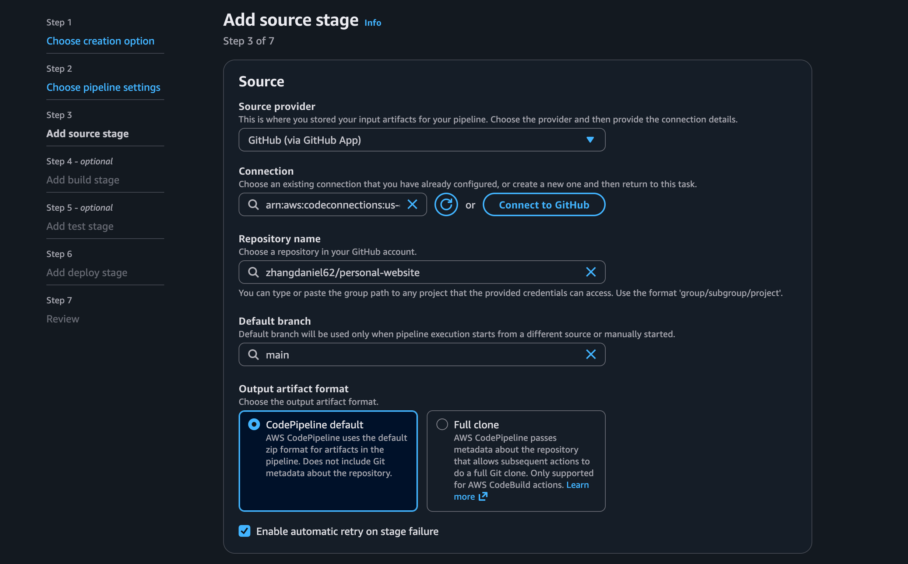
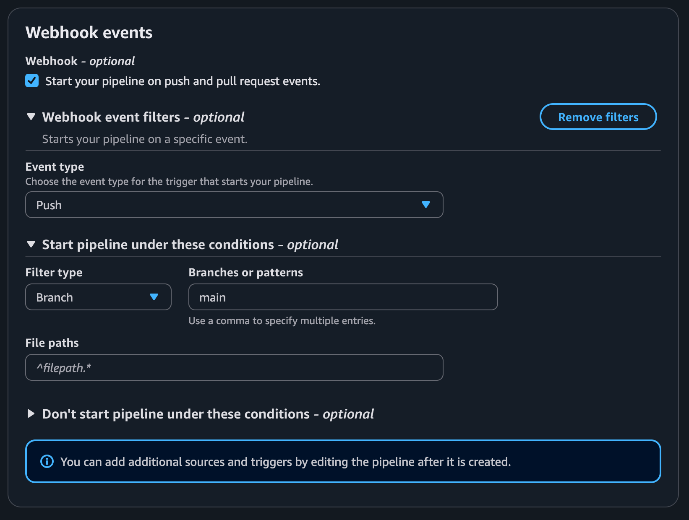
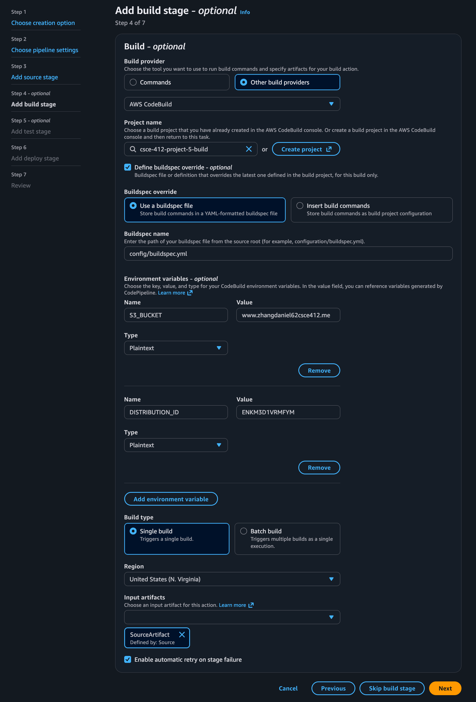

# Project 4: Hosting a site with HTTPS and a custom domain

The goal of the following project was to host a static website on the internet using a custom domain and HTTPS. In order to achieve this, multiple services were used, each to accomplish a specific role.

---

## Services Used

### Namecheap: Domain Registration

Namecheap was used to purchase a domain ([zhangdaniel62csce412.me](zhangdaniel62csce412.me)). This was used to have a human-readable domain name that users could use to access said website. It provides a readable and memorable address that users can enter in a browser.

### Amazon S3: Hosting Service

Amazon S3 is a cloud storage service used to host static content such as HTML, CSS, and JavaScript files. It acts as a simple web server for static content.

### Amazon Route 53: DNS Service

Route 53 is used to route users that visit the domain to the correct AWS resource. This is important as it allows for traffic for the domain to the correct location. In addition, it is used for certificate validation through ACM. It translates the domain name into the appropriate Cloudfront distribution, allowing users to access the website using a human-readable URL.

### AWS Certificate Manager (ACM): SSL Certificate

ACM was used to provision and deploy a secure HTTPS certificate. It is essential to convert the website from HTTP to HTTPS, which in essence encrypts the data between the user and the website. 

### Amazon Cloudfront: CDN + HTTPS Layer

Cloudfront is responsible for distributing the website hosted on S3 globally and enabling HTTPS using the ACM certificate that was provisioned by ACM. It caches content on edge servers (servers that are closest to the user) to improve latency and the general responsiveness of the website. This includes images, files, and stylesheets. In addition, Cloudfront is required because S3 does not natively support HTTPS for custom domains (such as the one that was purchased off of Namecheap).

Together, these  services allowed the website to be securely accessed through a custom domain ([zhangdaniel62csce412.me](zhangdaniel62csce412.me)). The structure used is scalable and cost-efficient, as it does not require the management of physical servers.

---

## Flow Chart

The following flow chart shows the order and dependencies of each service that was used to host my website ([zhangdaniel62csce412.me](zhangdaniel62csce412.me)) remotely:



When a user enters the domain name into their browser, a DNS query is sent to Route 53, which acts as the DNS service, resolving the domain name to the next step. Route 53 contains a record that then points the domain to Cloudfront using an alias record. This allows the user to access the website using the custom domain name that was purchased off of Namecheap.

Once the request reaches Cloudfront, the service then handles HTTPS by using the certificate that was provisioned by AWS Certificate Manager (ACM). This ensures that the data between the user and the website is encrypted and secure. The service then checks to see whether the requested data is already cached at an edge location close to the user. If it is cached, the content is returned immediately to the user, improving performance and reducing latency. If the content is not cached, Cloudfront then forwards the request to Amazon S3, where the static content is stored. This includes HTML, CSS, and JavaScript files.

S3 then returns the requested content to Cloudfront then caches the content for future requests and delivers the website back to the user over a secure HTTPS connection.

---

## Screenshot of the [website](zhangdaniel62csce412.me) with proof that it is secured



---

# Project 5: Creation of a CI/CD pipeline that automatically updates upon a push

TODO: write a description/quick intro as well as an explanation of everything that was used. Add a system flow diagram from eraser.io.


## Services Used

### Namecheap: Domain Registration

Namecheap was used to purchase a domain ([zhangdaniel62csce412.me](zhangdaniel62csce412.me)). This was used to have a human-readable domain name that users could use to access said website. It provides a readable and memorable address that users can enter in a browser.

### Amazon S3: Hosting Service

Amazon S3 is a cloud storage service used to host static content such as HTML, CSS, and JavaScript files. It acts as a simple web server for static content. The direct endpoint to the S3 bucket was hidden, and the website is only accessible through the Cloudfront distribution. This is done to ensure that all traffic to the website goes through Cloudfront, which provides HTTPS and caching.

### Amazon Route 53: DNS Service

Route 53 is used to route users that visit the domain to the correct AWS resource. This is important as it allows for traffic for the domain to the correct location. In addition, it is used for certificate validation through ACM. It translates the domain name into the appropriate Cloudfront distribution, allowing users to access the website using a human-readable URL.

### AWS Certificate Manager (ACM): SSL Certificate

ACM was used to provision and deploy a secure HTTPS certificate. It is essential to convert the website from HTTP to HTTPS, which in essence encrypts the data between the user and the website. 

### Amazon Cloudfront: CDN + HTTPS Layer

Cloudfront is responsible for distributing the website hosted on S3 globally and enabling HTTPS using the ACM certificate that was provisioned by ACM. It caches content on edge servers (servers that are closest to the user) to improve latency and the general responsiveness of the website. This includes images, files, and stylesheets. In addition, Cloudfront is required because S3 does not natively support HTTPS for custom domains (such as the one that was purchased off of Namecheap). An origin access identity (OAI) was also created to restrict access to the S3 bucket, ensuring that all traffic goes through Cloudfront.

### AWS CodeBuild: Build Service

CodeBuild is a fully managed build service that compiles source code, runs tests, and produces software packages that are ready to deploy. It was used to build the website and prepare it for deployment. In this case, it was used to sync the local files to the S3 bucket and create an invalidation for the Cloudfront distribution to ensure that the latest changes are reflected on the website.

### AWS CodePipeline: CI/CD Service

CodePipeline is a fully managed continuous integration and continuous delivery (CI/CD) service that helps automate the build, test, and deploy phases of the release process. It was used to create a pipeline that automatically updates the website whenever a change is pushed to the main branch of the GitHub repository. The pipeline is triggered by a webhook from GitHub, which starts the build process in CodeBuild if a change is pushed. Once the build is complete, the changes are deployed to S3 and Cloudfront is flushed of its cache to reflect the latest changes on the website.

Together, these services allowed the website to be securely accessed through a custom domain ([zhangdaniel62csce412.me](zhangdaniel62csce412.me)). The structure used is scalable and cost-efficient, as it does not require the management of physical servers.

---

## Process of the creation of the CI/CD pipeline

A CI/CD pipeline was created using AWS CodePipeline and CodeBuild to automate deployment of the static website. The pipeline pulls source code from a GitHub repository, runs a build step defined in a buildspec file, and deploys the updated files to an S3 bucket, with CloudFront invalidation to reflect changes immediately. The existing architecture from Project 4 (S3, CloudFront, Route 53, ACM) was extended by making the S3 bucket private and configuring CloudFront with Origin Access Control (OAC) so that content is only accessible through the domain. This allows any updates pushed to GitHub to automatically propagate to the live website while maintaining secure access.

### Deploying an AWS CodeBuild build project:

TODO: Clean this up and make it look and sound better

1. Go to CodeBuild -> Build projects -> Create build project.
2. Name your project and select "Default Project" for the project type
3. Select "No source" as the source, as CodePipeline will provide the source.
4. Select the following in environment (should be the defaults): 
  - provisioning model: on-demand
  - environment image: managed image
  - compute: EC2
  - running mode: container
  - OS: Amazon Linux
  - Runtime: Standard
  - Image version: use latest
  - rest are default
5. for Buildspec, choose "insert build commands", and enter the following as a build command, which will be overridden later after the pipeline is fully built:
`echo "Build has started"`

6. Create the build project

### Deploying CodePipeline:

1. Click on create new pipeline, then build custom pipeline: 
2. Name the pipeline, and change the execution mode to "Superseded", which overrides a run if a new change is pushed to the website. Keep the following settings:
  - Create new service role
  - artifact store: Default location
  - encryption key: Default AWS Managed Key

3. Select "GitHub (via GitHub App)" as the source provider, and connect a GitHub Connection to CodePipeline. If it isn't created, go ahead and create one. Install an app to connect to the repository as a bot. Choose the correct repository as well as the branch which will have changes tracked. Ensure that "Start your pipeline on push and pull request events." is enabled. 
4. Add the following webhook event filter to ensure that the pipeline is run only when a change is pushed directly to main or a PR is merged into the main branch:
  - Event type: Push
  - Filter type: Branch
  - Branches or patterns: main

5. Choose "Other build providers -> AWS CodeBuild" as the build provider, and select the CodeBuild build project made previously. 
6. Select "Insert build commands", and enter the following:
```sh
version: 0.2

phases:  
	pre_build:    
		commands:      
			- echo "Pipeline buildspec file ran"  
	build:    
		commands:      
			- aws s3 sync . s3://$S3_BUCKET --delete --exclude ".git/*" --exclude "config/buildspec.yml"      
			- aws cloudfront create-invalidation --distribution-id $DISTRIBUTION_ID --paths "/*"
```
7. Add the following environment variables as plaintext:
  - Name of S3 bucket hosting the website
  - ID of CloudFront distribution
8. Ensure that the following are correct:
  1. Build type: Single build
  2. Input artifact contains source artifact


> [!IMPORTANT]
> In order to avoid potential issues, it is advised that the region of the pipeline is identical to the region that your S3 bucket is located

9. Skip the addition of a test phase, as it is not needed.
10. Skip the deploy stage, as it is not needed.
11. Ensure all information is correct, and create the pipeline.

> [!NOTE] 
> the parameter `DetectChanges` will appear to be false. This is expected, as a custom webhook was created.

### Edits to S3 and CloudFront:


---

## How to update the website automatically

TODO: Something something how it is updated via push to the main branch, hopefully does the same if a PR is merged into the main branch?

TODO: Add proof (photos) of before and after